# Project Architecture (P vs NP Verified Notebook)

This document describes the current structure, flows, and control points of the repo.

## Goals and invariants

- Formal truth lives in `formal/` (authoritative: `formal/PvNP/Core/`).
- `formal/PvNP/Core/` and `formal/WIP/Verified/` cannot contain `sorry`, `admit`, or `axiom`.
- Docs are navigation and reasoning, not proofs.
- One run is intended to yield one artifact (protocol text lives in `STRICT.disabled-for-your-current-session.AGENTS.md`).
- Prompts are single line and `docs/agent_brief.md` stays bounded.
- `scripts/verify_all.sh` is the canonical gate.

## Top-level map

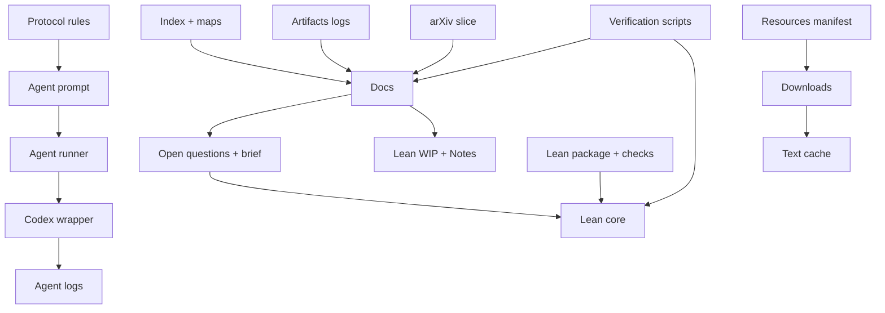

## Directory roles

- `README.md` - quick overview and entry point.
- `P_vs_NP.md` - main index and navigation.
- `P_vs_NP.diagram.md` / `P_vs_NP.mindmap.md` - repository maps.
- `STRICT.disabled-for-your-current-session.AGENTS.md` - agent protocol (named as disabled; prompt still points to AGENTS.md).
- `ARCHITECTURE.md` - this file.

- `docs/` - written theory and logs (non-authoritative).
  - `00_...` through `16_...` are the main narrative notes.
  - `docs/open_questions.md` - active queue with metadata and oracle fields.
  - `docs/agent_brief.md` - bounded working memory and anti-loop state.
  - `docs/artifacts.tsv` - completed artifacts (Commit = git hash).
  - `docs/planned.tsv` - queued artifacts (Commit = PENDING).
  - `docs/roadmap.md`, `docs/sources.md` - route and citations.
  - `docs/q43_s*.md` - step-by-step Q43 work log snapshots.

- `formal/` - Lean 4 proof layer.
  - `formal/PvNP/Core/` - authoritative definitions and lemmas.
  - `formal/PvNP/Main.lean` and `formal/PvNP.lean` - core entry points.
  - `formal/WIP/Verified/` - WIP proofs with no `sorry`/`axiom`.
  - `formal/WIP/Scratch/` - scratchpad (placeholders allowed).
  - `formal/WIP.lean` - imports `WIP/Verified/Work.lean`.
  - `formal/Notes/` and `formal/Notes.lean` - long notes as doc-comments.
  - `formal/Checks/AxiomsCheck.lean` - axioms audit.
  - `formal/lakefile.lean`, `formal/lean-toolchain`, `formal/lake-manifest.json` - build config.

- `agent/` - local runner scripts.
  - `agent/run.sh` - main runner (lock + log + codex wrapper).
  - `agent/run_core.sh`, `agent/run_wip.sh` - presets for `RUN_MODE`.
  - `agent/codex-run.sh` - wraps `codex exec`, supports `--infinite`.
  - `agent/logs/` - run logs; `latest.log` symlink.

- `scripts/` - verification and tooling.
  - `scripts/verify_all.sh` - docs + formal gate.
  - `scripts/verify_notebook.py` - docs structure/resource checks and prompt checks.
  - `scripts/check_axioms.py` - runs `formal/Checks/AxiomsCheck.lean`.
  - `scripts/register_artifact.py` - append artifact log and update brief.
  - `scripts/agent_prompt.txt` - single-line prompt for runners.
  - `scripts/toy_*.py` - oracle checks for Q39/Q43.
  - `scripts/arxiv_search.py` - slice arXiv metadata into `resources/arxiv/`.

- `resources/` - bibliography and downloads.
  - `resources/manifest.tsv` - canonical list of sources.
  - `resources/download_resources.py` - downloader + listing helper.
- `resources/downloads/` - gitignored cache of PDFs/HTML.
  - `resources/extract_text_cache.py` - build `resources/text_cache/` (gitignored).
  - `resources/arxiv/pvnp_slice.tsv` - curated arXiv slice.
  - `resources/README.md` - usage notes.

- `image/` - README assets.

## Agent execution flow

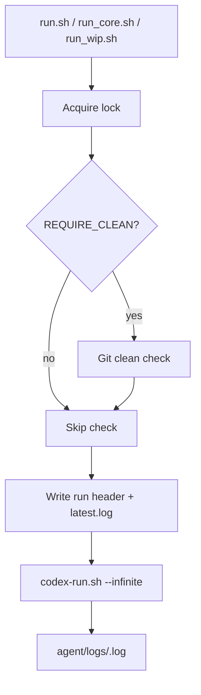

### Runner behavior

- `agent/run.sh` sets paths, acquires `agent/logs/.agent.lock`, and writes a header to the log.
- `agent/codex-run.sh` wraps `codex exec` and supports `--infinite` session cycling.
- `agent/run_core.sh` sets `RUN_MODE=core`, `LEAN_FORCE_REBUILD=1`.
- `agent/run_wip.sh` sets `RUN_MODE=wip`, `LEAN_FORCE_REBUILD=0`.

### Runner configuration (env vars)

- `PROMPT_FILE`, `LOG_DIR`, `RUN_ID`, `LOG_FILE`, `LOCK_FILE`
- `RUN_MODE` (`core` default; `wip` and `docs` are supported)
- `REQUIRE_CLEAN` (truthy enables git clean check)
- `LEAN_FORCE_REBUILD` (controls `lake clean` in `scripts/verify_all.sh`)
- `CODEX_TTY`, `CODEX_SESSION_CYCLES`

## Agent run loop (expected)

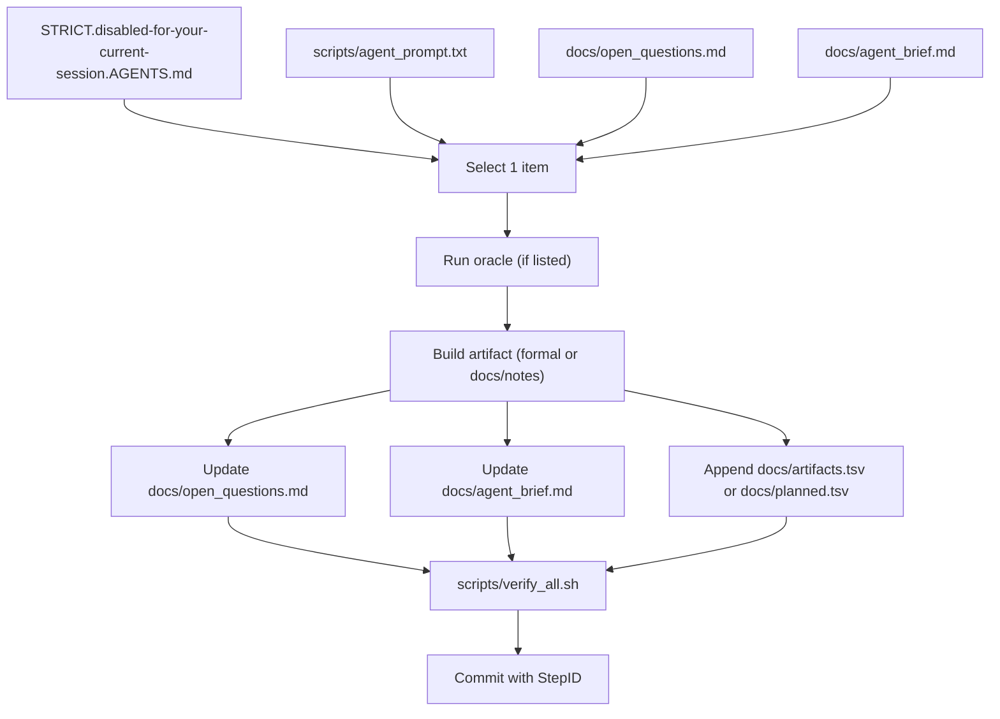

## Agent reasoning template (per protocol)

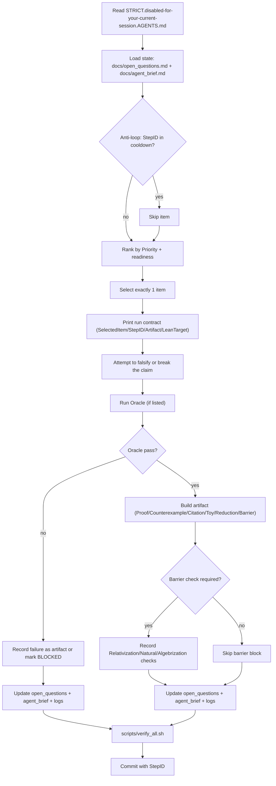

## Agent outcome routing (single artifact)

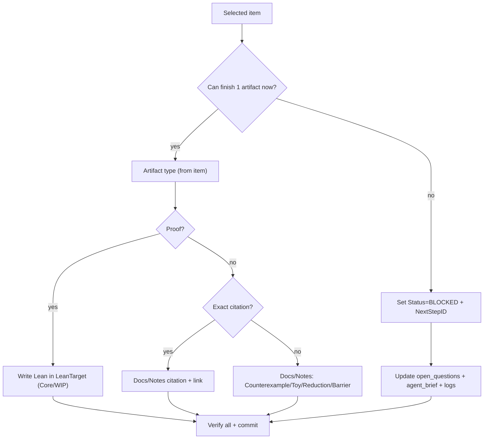

## Anti-loop + stop rules

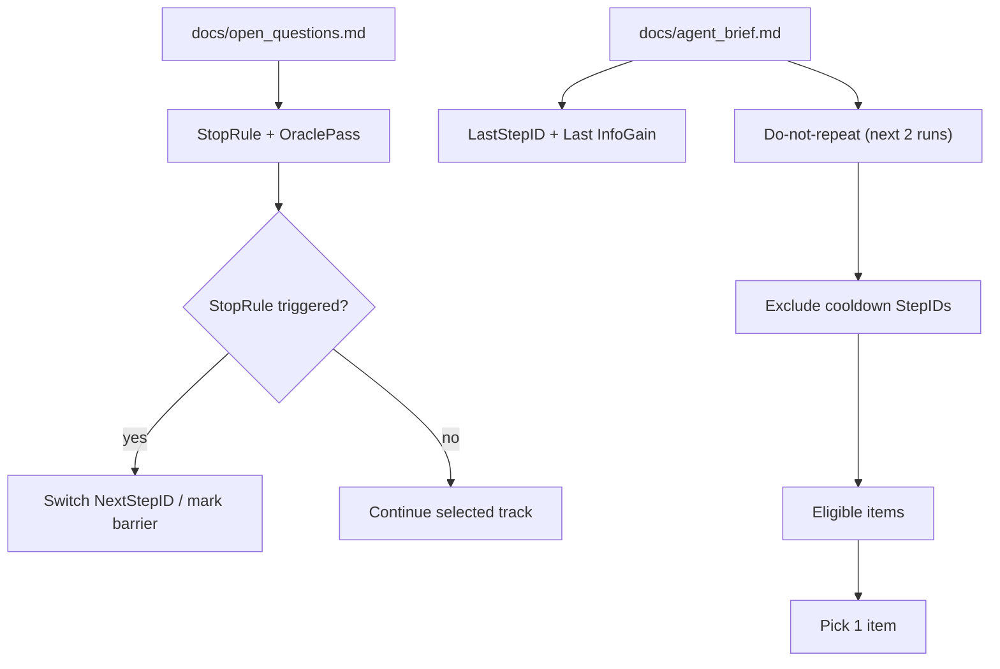

## Run contract template (printed at start)

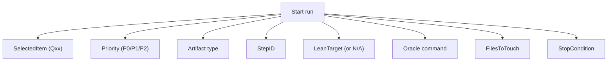

## Barrier check template

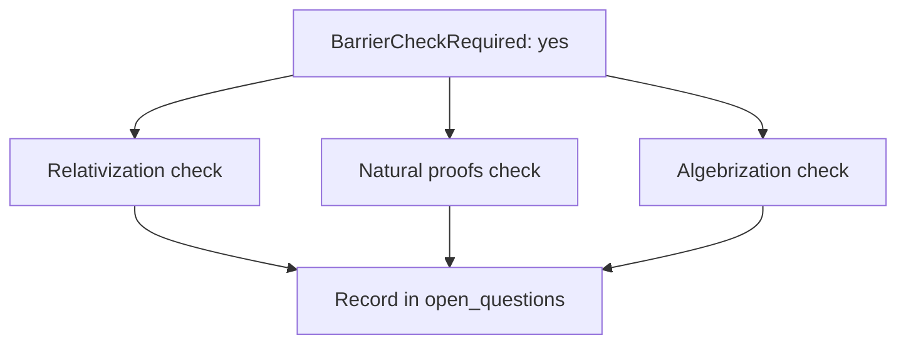

## File touch matrix (by artifact type)

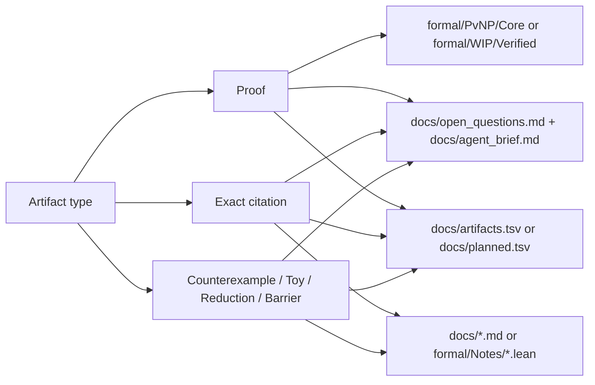

## Verification pipeline

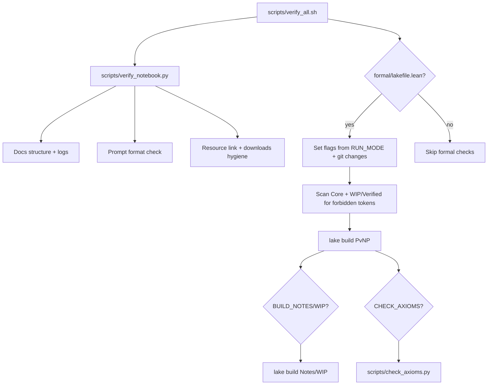

Notes:

- Resource checks are skipped when `resources/downloads/` is missing or `SKIP_RESOURCE_CHECKS=1`.
- `FORMAL_SKIP=1` requires `ALLOW_FORMAL_SKIP=1` or the run fails.
- `REQUIRE_LEAN=0` requires `ALLOW_REQUIRE_LEAN_SKIP=1` if any `formal/` file changed.
- `RUN_MODE` defaults:
  - `docs`: `REQUIRE_LEAN=0`, `BUILD_NOTES=0`, `BUILD_WIP=0`, `CHECK_AXIOMS=0`
  - `wip`: `REQUIRE_LEAN=1`, `BUILD_WIP=1`, `CHECK_AXIOMS=0`
  - `core`: `REQUIRE_LEAN=1`, `BUILD_NOTES=0`, `BUILD_WIP=0`, `CHECK_AXIOMS=1`
- Changes under `formal/Notes/` or `formal/WIP/` force `BUILD_NOTES=1` or `BUILD_WIP=1`.
- Core and WIP/Verified are scanned for `sorry`, `admit`, `axiom`, and placeholder `Prop := True`.

Optional toy checks can be executed with:

```bash
python3 scripts/verify_notebook.py --checks path/to/toy_checks.py
```

## Docs checks (verify_notebook.py)

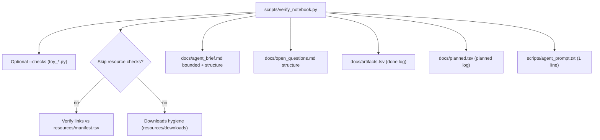

## Research artifact flow

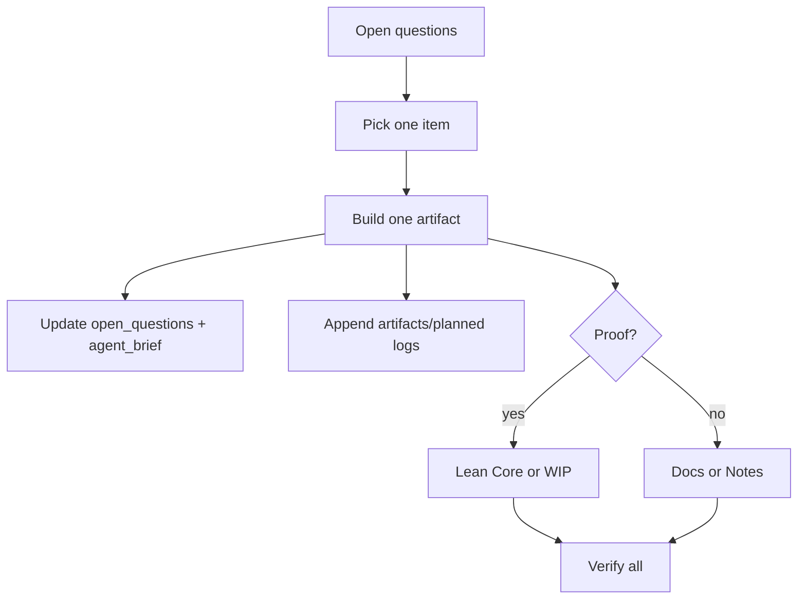

- `scripts/register_artifact.py` appends to `docs/artifacts.tsv` (or `docs/planned.tsv`) and updates `docs/agent_brief.md`.

## Open question item schema (ACTIVE)

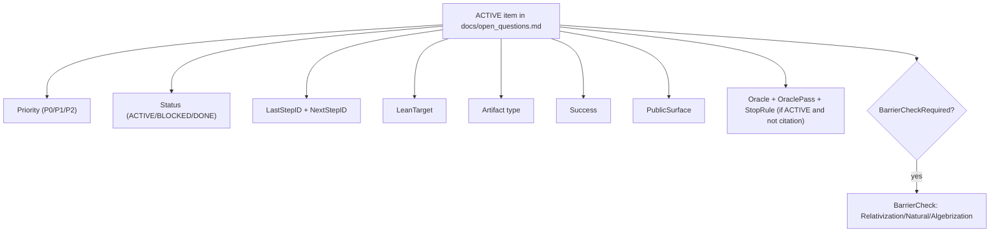

## Artifact registration (scripts/register_artifact.py)

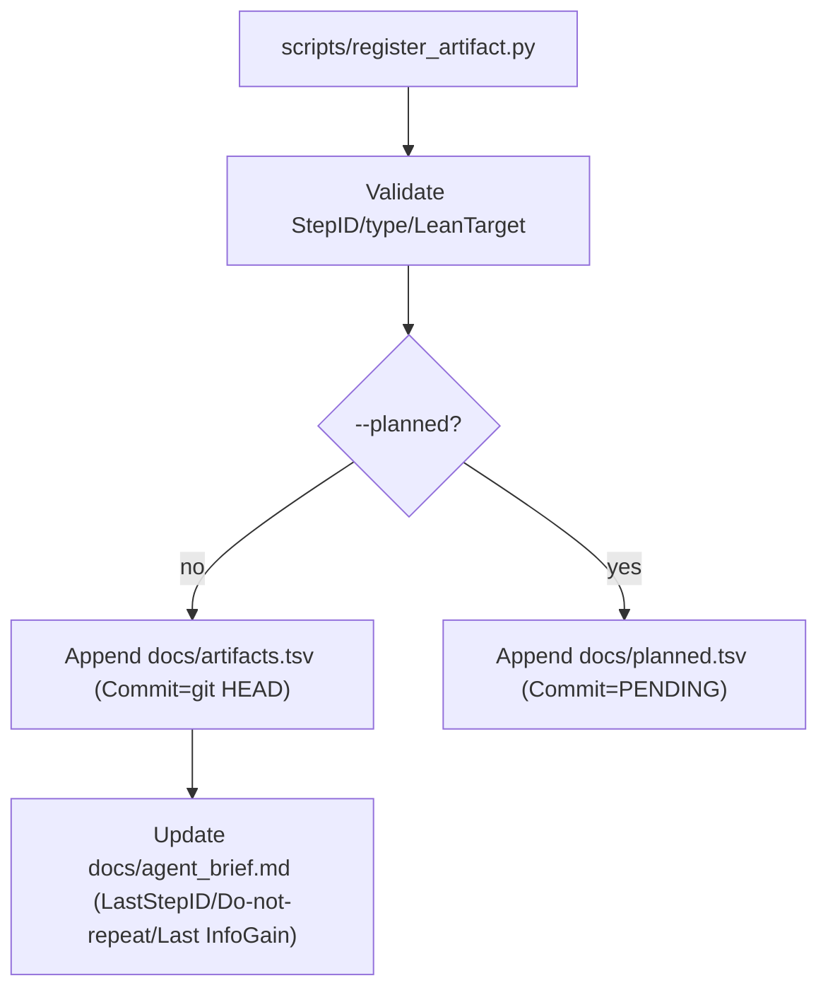

## Resources and search flow

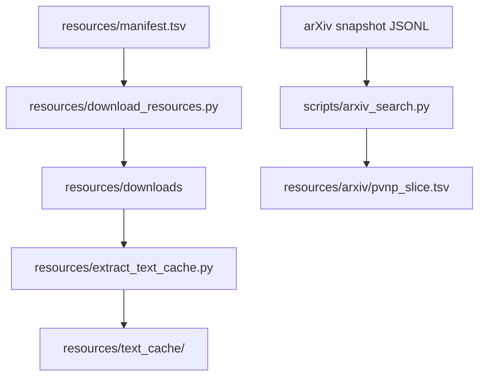

## Formal layer structure

- `formal/PvNP/Main.lean` - main core entry point.
- `formal/PvNP/Core/Defs.lean` - definitions (P, NP, languages).
- `formal/PvNP/Core/Basic.lean` - baseline facts imported by Main.
- `formal/PvNP/Core/SAT.lean`, `formal/PvNP/Core/ReductionsSAT.lean` - SAT and SAT reductions.
- `formal/PvNP/Core/Reductions.lean` - generic reductions and NP-complete material.
- `formal/PvNP/Core/Graph.lean` - graph primitives used by reductions.
- `formal/PvNP.lean` - root import that pulls in `PvNP/Main.lean`.
- `formal/WIP/Verified/Q39.lean`, `formal/WIP/Verified/Q43.lean` - current formal targets.
- `formal/WIP/Verified/Work.lean` - aggregator for verified WIP.
- `formal/WIP.lean` - WIP entry point.
- `formal/Notes/*.lean` - research notes as doc-comments.
- `formal/Checks/AxiomsCheck.lean` - axioms audit list.

## Key control points (where to improve)

- `STRICT.disabled-for-your-current-session.AGENTS.md` - protocol and artifact rules.
- `scripts/agent_prompt.txt` - single-line run prompt.
- `docs/open_questions.md` - queue quality drives progress.
- `docs/agent_brief.md` - anti-loop and bounded state.
- `docs/artifacts.tsv` / `docs/planned.tsv` - artifact tracking.
- `formal/PvNP/Core/` - authoritative zone.
- `formal/WIP/Verified/` - current Lean target surface.
- `scripts/verify_all.sh` and `scripts/verify_notebook.py` - stability checks.
- `resources/manifest.tsv` - bibliography control point.

## Operating assumptions

- `scripts/verify_all.sh` is the canonical gate for docs and Lean.
- Formal builds can be skipped only with explicit `FORMAL_SKIP`/`ALLOW_FORMAL_SKIP`.
- Core builds run by default when Lean is available; Notes/WIP builds are opt-in or auto-enabled by changes.
- Resource checks depend on `resources/downloads/` and can be skipped.
- Only `formal/PvNP/Core/` proofs are authoritative for final results.

## Extension checklist

- Add new research question: edit `docs/open_questions.md` with `LeanTarget`, `NextStepID`, and oracle fields.
- Record an artifact: use `scripts/register_artifact.py` or append to `docs/artifacts.tsv`.
- Add authoritative Lean fact: implement in `formal/PvNP/Core/` and import via `formal/PvNP/Main.lean`.
- Add WIP Lean fact: implement in `formal/WIP/Verified/` and import via `formal/WIP/Verified/Work.lean`.
- Add long-form reasoning: put it in `formal/Notes/*.lean` (doc-comments) or `docs/`.
- Add new resource: append to `resources/manifest.tsv`, then fetch with `resources/download_resources.py`.
- Build/update arXiv slice: ensure snapshot in `resources/downloads/`, run `scripts/arxiv_search.py`.
- Add a toy check: create a `.py` and run via `scripts/verify_notebook.py --checks`.

## Known hot spots

- Active queue items live in `docs/open_questions.md`.
- Q39 and Q43 remain the primary active Lean targets (`formal/WIP/Verified/Q39.lean`, `formal/WIP/Verified/Q43.lean`).
- The Q43 step log series lives in `docs/q43_s*.md`.
