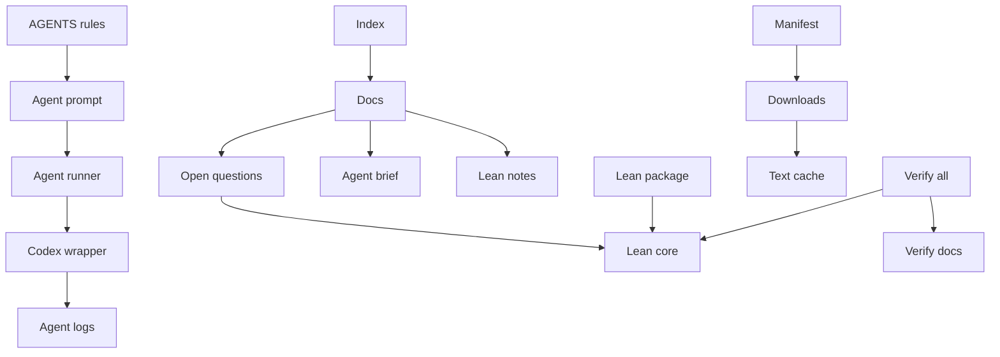
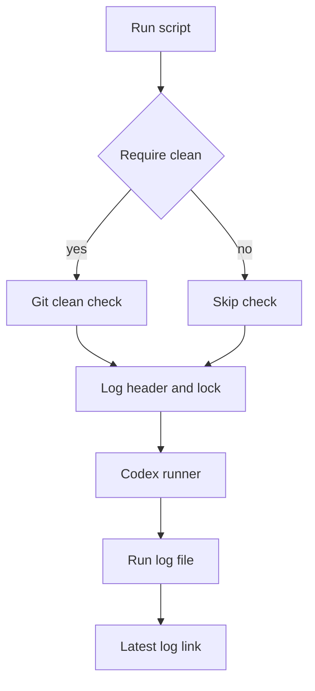
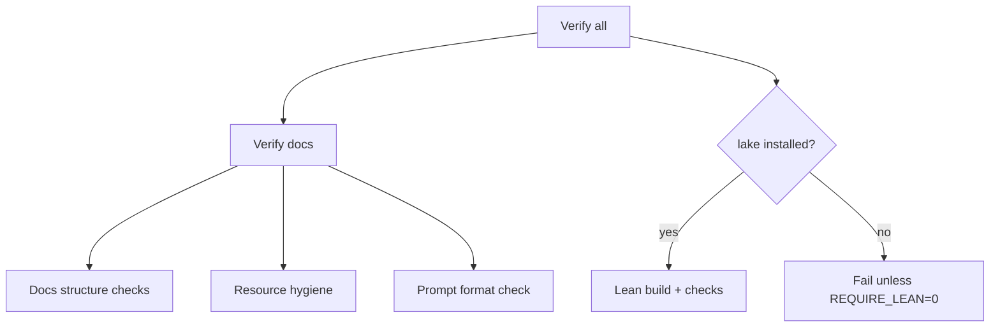
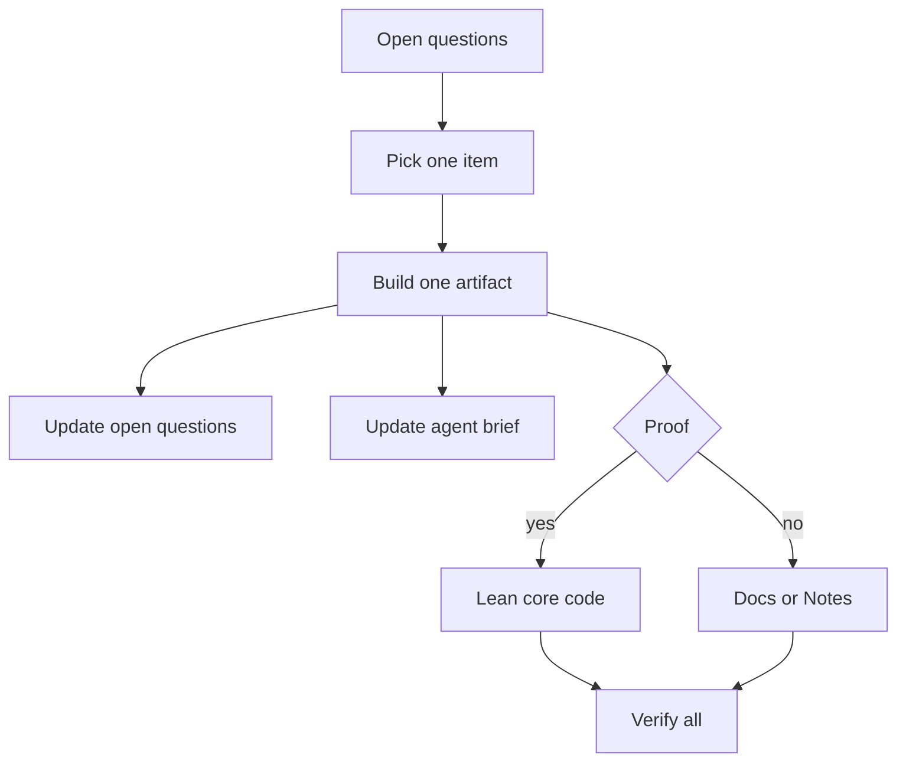
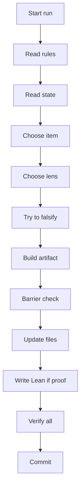
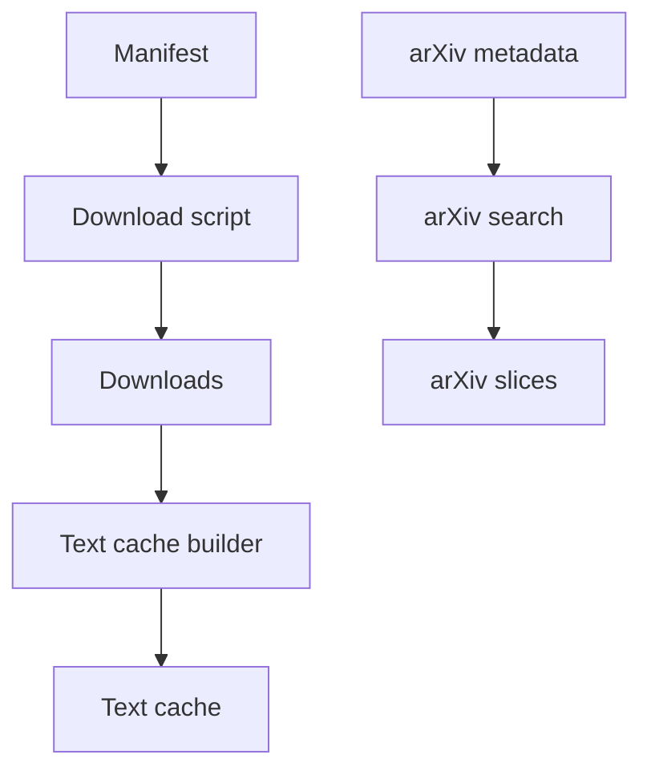

# Project Architecture (P vs NP)

This document describes the current structure, flows, and control points of the repo so you can see
where to improve it.

## Goals and invariants

- Proof-first: authoritative results live in `formal/PvNP/Core/` (no `sorry`/`axiom`).
- Docs are navigation + reasoning; they are not proofs.
- One agent run = one checkable artifact.
- No notebooks: the project is Lean-first and CLI-verified.
- Stable, bounded operational state (short prompts, bounded agent brief).

## Top-level map



## Directory roles

- `AGENTS.md` — canonical agent protocol and constraints.
- `P_vs_NP.md` — short top-level index + links.
- `docs/` — structured written theory; kept short; history is in git.
  - `docs/open_questions.md` — active queue; each item has `StepID`, `NextStepID`, `LeanTarget`.
  - `docs/agent_brief.md` — bounded working memory to avoid loops.
  - `docs/artifacts.tsv` — append-only artifact log (StepID/type/target/commit).
  - `docs/roadmap.md`, `docs/sources.md` — route and citations.
- `formal/` — Lean 4 proof layer.
  - `formal/PvNP/Core/` — authoritative definitions/lemmas (no `sorry`/`axiom`).
  - `formal/WIP/` — work-in-progress Lean proofs (non-authoritative).
  - `formal/Notes/` — research notes as Lean doc-comments (not proofs).
  - `formal/Checks/` — Lean checks (axioms audit).
  - `formal/lakefile.lean` — depends on `Paperproof`.
- `agent/` — runner wrappers around Codex CLI.
- `scripts/` — verification and tooling (checks, arXiv search).
- `resources/` — bibliography + downloaded PDFs + optional text cache.

## Agent execution flow



### Runner behavior

- `agent/run.sh` sets defaults and writes to `agent/logs/`.
- `agent/codex-run.sh` wraps `codex exec`, supports `--infinite`, and can use a pseudo‑TTY.
- `CODEX_TTY` (default `auto`) controls color/TTY behavior:
  - `CODEX_TTY=1` force pseudo‑TTY.
  - `CODEX_TTY=0` disable pseudo‑TTY.

### Runner configuration (env vars)

- `PROMPT_FILE`, `LOG_DIR`, `RUN_ID`, `LOG_FILE`
- `REQUIRE_CLEAN=1` to require a clean git worktree
- `CODEX_TTY` to control colored output
- `RUN_MODE=docs|wip|core` to tune verification defaults

## Verification pipeline



Optional toy checks can be executed with:

```bash
python3 scripts/verify_notebook.py --checks path/to/toy_checks.py
```

Lean verification knobs (defaults shown):
- `REQUIRE_LEAN=1` — fail if `lake` is missing (set to `0` to skip).
- `BUILD_NOTES=0` — build `Notes` only when needed.
- `BUILD_WIP=0` — build `WIP` only when needed.
- `CHECK_AXIOMS=1` — run the axioms audit for core theorems.
Core hygiene: `verify_all.sh` fails if `sorry`/`admit`/`axiom` appears in `formal/PvNP/Core/`.
`RUN_MODE=docs|wip|core` sets sensible defaults for the flags above.

## Research artifact flow



## Agent behavior architecture (expected protocol)

This is how the agent is expected to behave given `AGENTS.md` and the current pipeline.

Core inputs:
- `AGENTS.md` (rules, artifacts, anti-loop, barrier checks)
- `docs/agent_brief.md` (do-not-repeat + current bottleneck)
- `docs/open_questions.md` (active queue with `NextStepID` + `LeanTarget`)
- `scripts/agent_prompt.txt` (single-line run prompt)
- `agent/logs/` (optional context for supervisors, not required for every run)

Core outputs per run:
- One artifact (Proof / Counterexample / Exact citation / Toy / Reduction / Barrier).
- Updated `docs/open_questions.md`, `docs/agent_brief.md`, and `docs/artifacts.tsv` (see `scripts/register_artifact.py`).
- Passing `scripts/verify_all.sh`.
- One commit with `StepID` in the message.



Protocol highlights:
- Exactly one artifact per run. If no artifact: mark BLOCKED and stop.
- Proof artifacts must add real Lean code in the specified `LeanTarget`.
- Anti-loop: do not repeat `StepID` in `agent_brief` and avoid items in cooldown.
- Barrier checks are mandatory for any research step that touches separation claims.

## Resources and search flow



## Formal layer structure

- `formal/PvNP/Main.lean` — entry point for authoritative core.
- `formal/PvNP/Core/*.lean` — authoritative definitions/lemmas (no `sorry`/`axiom`).
- `formal/WIP/Work.lean` — WIP proof file and placeholders for active tasks.
- `formal/Notes.lean` — imports all note modules.
- `formal/Notes/*.lean` — long research notes (doc-comments, not proof terms).
- `formal/Checks/AxiomsCheck.lean` — axioms audit list for core theorems.
- `Paperproof` — external dependency defined in `formal/lakefile.lean`.

## Key control points (where to improve)

- `AGENTS.md`: tighten/relax constraints, artifacts, and anti-loop policy.
- `scripts/agent_prompt.txt`: single-line prompt, easiest high-leverage change.
- `docs/open_questions.md`: quality of StepID + Success criteria determines progress.
- `formal/PvNP/Core/`: authoritative zone (no `sorry`/`axiom`).
- `formal/WIP/Work.lean`: current proof surface for new Lean facts.
- `scripts/verify_notebook.py`: structural invariants for stability.

## Operating assumptions

- Lean build is required by default; set `REQUIRE_LEAN=0` to skip if needed.
- Core builds always; `BUILD_NOTES=1`/`BUILD_WIP=1` opt into Notes/WIP builds.
- Docs are short and curated; long reasoning goes into `formal/Notes/`.
- Only `formal/PvNP/Core/` proofs are considered authoritative.

## Extension checklist

- Add new research question: edit `docs/open_questions.md` with `LeanTarget`.
- Add authoritative Lean fact: implement in `formal/PvNP/Core/` and import via `formal/PvNP/Main.lean`.
- Add WIP Lean fact: implement in `formal/WIP/` (non-authoritative).
- Add new resource: append to `resources/manifest.tsv`, download to `resources/downloads/`.
- Add new check: implement a small `toy_checks.py` and wire through `--checks`.

## Known hot spots

- Q39 and Q43 are active research items (see `docs/open_questions.md`).
- `formal/WIP/Work.lean` contains placeholders for current formal targets.
