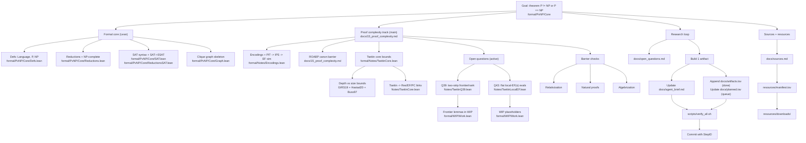

# P vs NP: Digging Map

Single high-level map of how the repository work tree connects and where the current digging sits.

```mermaid
flowchart TD
  A["Goal: theorem P != NP or P == NP\nformal/PvNP/Core"]

  A --> B["Formal core (Lean)"]
  B --> B1["Defs: Language, P, NP\nformal/PvNP/Core/Defs.lean"]
  B --> B2["Reductions + NP-complete\nformal/PvNP/Core/Reductions.lean"]
  B --> B3["SAT syntax + SAT->3SAT\nformal/PvNP/Core/SAT.lean\nformal/PvNP/Core/ReductionsSAT.lean"]
  B --> B4["Clique graph skeleton\nformal/PvNP/Core/Graph.lean"]

  A --> C["Proof complexity track (main)\ndocs/15_proof_complexity.md"]
  C --> C1["Encodings + PIT -> IPS -> EF sim\nformal/Notes/Encodings.lean"]
  C --> C2["ROABP canon barrier\ndocs/15_proof_complexity.md"]
  C --> C3["Tseitin core bounds\nformal/Notes/TseitinCore.lean"]
  C3 --> C31["Depth vs size bounds\nGIRS19 + Hastad20 + Buss97"]
  C3 --> C32["Tseitin -> Res/EF/PC links\nNotes/TseitinCore.lean"]

  C --> Q["Open questions (active)"]
  Q --> Q39["Q39: two-strip frontier/rank\nNotes/TseitinQ39.lean"]
  Q39 --> Q39w["Frontier lemmas in WIP\nformal/WIP/Work.lean"]
  Q --> Q43["Q43: flat local-EF(s) evals\nNotes/TseitinLocalEF.lean"]
  Q43 --> Q43w["WIP placeholders\nformal/WIP/Work.lean"]

  C --> D["Barrier checks"]
  D --> D1["Relativization"]
  D --> D2["Natural proofs"]
  D --> D3["Algebrization"]

  A --> E["Research loop"]
  E --> E1["docs/open_questions.md"]
  E --> E2["Build 1 artifact"]
  E2 --> E3["Update docs/agent_brief.md"]
  E2 --> E4["Append docs/artifacts.tsv (done)\nUpdate docs/planned.tsv (queue)"]
  E3 --> E5["scripts/verify_all.sh"]
  E4 --> E5
  E5 --> E6["Commit with StepID"]

  A --> F["Sources + resources"]
  F --> F1["docs/sources.md"]
  F1 --> F2["resources/manifest.tsv"]
  F2 --> F3["resources/downloads/"]
```
