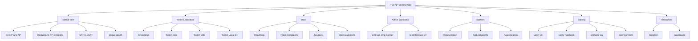

# P vs NP: Research Mindmap

Single-diagram snapshot of the current project landscape.

```mermaid
flowchart TD
  A[P vs NP verified first]
  A --> B[Formal core]
  B --> B1[Defs P and NP]
  B --> B2[Reductions NP complete]
  B --> B3[SAT to 3SAT]
  B --> B4[Clique graph]

  A --> C[Notes Lean docs]
  C --> C1[Encodings]
  C --> C2[Tseitin core]
  C --> C3[Tseitin Q39]
  C --> C4[Tseitin Local EF]

  A --> D[Docs]
  D --> D1[Roadmap]
  D --> D2[Proof complexity]
  D --> D3[Sources]
  D --> D4[Open questions]

  A --> E[Active questions]
  E --> E1[Q39 two strip frontier]
  E --> E2[Q43 flat local EF]

  A --> F[Barriers]
  F --> F1[Relativization]
  F --> F2[Natural proofs]
  F --> F3[Algebrization]

  A --> G[Tooling]
  G --> G1[verify all]
  G --> G2[verify notebook]
  G --> G3[artifacts log]
  G --> G4[agent prompt]

  A --> H[Resources]
  H --> H1[manifest]
  H --> H2[downloads]
```
