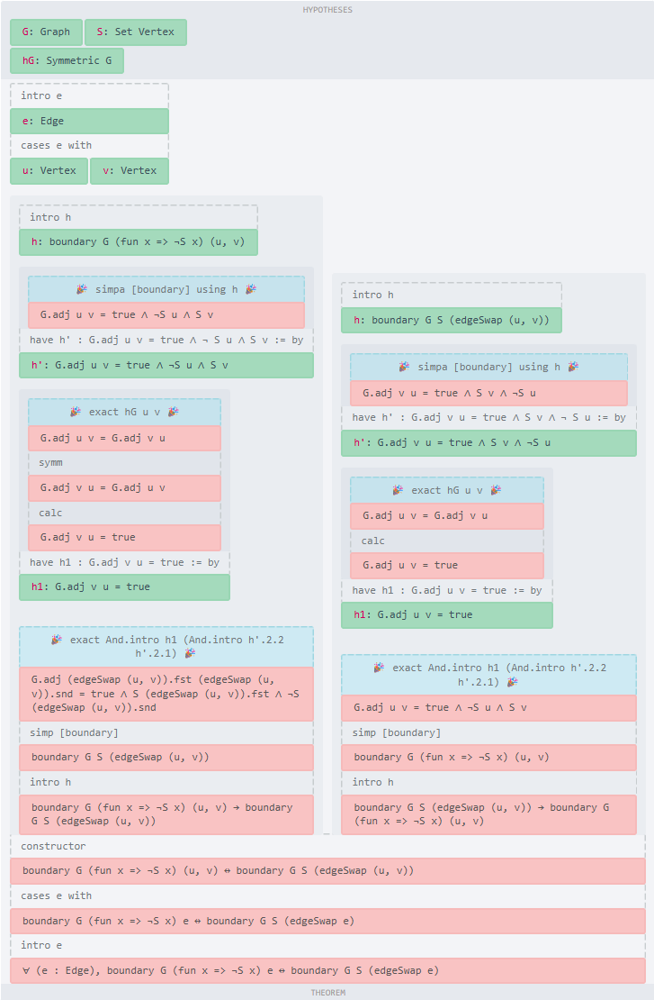

# P vs NP Verified Notebook

A verified-first research log aimed at small, checkable progress on P vs NP.
The core principle is: every durable claim must be supported by a formal proof
or a precise citation.

## Highlights

- Lean 4 formalization layer in `formal/`.
- Strict docs workflow with verifiers and artifact tracking.
- Single-step agent workflow for reproducible progress.

## Quick Start

```bash
scripts/verify_all.sh
```

## Project Layout

- `P_vs_NP.md`: status and index.
- `docs/`: open questions, agent brief, artifacts log.
- `formal/`: Lean proofs and notes.
- `resources/`: bibliography and pinned sources.
- `scripts/`: verification tooling.

## Verification

- Run `scripts/verify_all.sh` for markdown structure checks and Lean builds.
- See `AGENTS.md` for the research protocol and artifact requirements.
- Resource link checks are skipped when `resources/downloads` is missing; set `SKIP_RESOURCE_CHECKS=1` to skip explicitly.



## Contributing

Follow `AGENTS.md`, keep docs concise, and run `scripts/verify_all.sh` before committing.

## Data Notes

Downloaded PDFs are not committed. Fetch them with the resource scripts described
in `resources/README.md`.

## Status

Active research notebook with formal verification gates.
